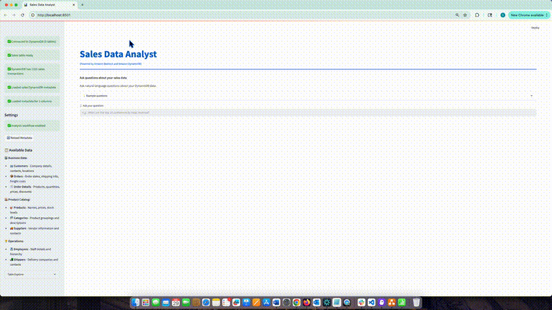

# Amazon Bedrock & DynamoDB Sales Analyst POC (Text to NoSQL)

## Overview of Solution

This is sample code demonstrating the use of Amazon Bedrock and Generative AI to create an intelligent sales data analyst that uses natural language questions to query NoSQL data stores, specifically Amazon DynamoDB. This example leverages the complete Northwind sample database with realistic sales scenarios containing customers, orders, and order details.



## Goal of this POC
The goal of this repo is to provide users the ability to use Amazon Bedrock and generative AI to ask natural language questions about sales performance, customer behavior, and business metrics. These questions are automatically transformed into optimized NoSQL queries against Amazon DynamoDB. This repo includes intelligent context retrieval using FAISS vector store, LangGraph workflow orchestration, and complete DynamoDB automation.

The architecture & flow of the POC is as follows:


When a user interacts with the POC, the flow is as follows:

1. **Natural Language Query**: The user makes a request through the Streamlit interface, asking a natural language question about sales data in DynamoDB (`app.py`)

2. **Query Understanding**: The natural language question is passed to Amazon Bedrock for intent analysis and query classification (`src/graph/workflow.py`)

3. **Context Retrieval**: The system performs semantic search using FAISS vector store to retrieve relevant database schema information and table relationships (`src/vector_store/faiss_manager.py`)

4. **Intelligent NoSQL Generation**: Amazon Bedrock generates optimized DynamoDB queries using the retrieved context, ensuring proper data access patterns and aggregation strategies (`src/graph/workflow.py`)

5. **Secure Query Execution**: The NoSQL query is executed against Amazon DynamoDB through AWS SDK (`src/utils/dynamodb_connector.py`)

6. **Result Analysis**: The retrieved data is passed back to Amazon Bedrock for intelligent analysis and insight generation (`src/graph/workflow.py`)

7. **Natural Language Response**: The system returns comprehensive insights and explanations to the user through the Streamlit frontend (`app.py`)

## How to use this Repo

### Prerequisites

1. [AWS CLI](https://docs.aws.amazon.com/cli/latest/userguide/getting-started-install.html) installed and configured with access to Amazon Bedrock.

2. [Python](https://www.python.org/downloads/) v3.8 or greater. The POC runs on Python.

3. AWS account with permissions to access Amazon Bedrock and DynamoDB services.

### Steps

1. Install Git (Optional step):
    ```bash
    # Amazon Linux / CentOS / RHEL:
    sudo yum install -y git
    # Ubuntu / Debian:
    sudo apt-get install -y git
    # Mac/Windows: Git is usually pre-installed
    ```

2. Clone the repository to your local machine.

    ```bash
    git clone https://github.com/AWS-Samples-GenAI-FSI/sales-analyst-bedrock-dynamodb.git
    ```
    
    The file structure of this POC is organized as follows:
    
    * `requirements.txt` - All dependencies needed for the application
    * `app.py` - Main Streamlit application with UI components
    * `src/bedrock/bedrock_helper.py` - Amazon Bedrock client wrapper
    * `src/graph/workflow.py` - LangGraph workflow orchestration
    * `src/vector_store/faiss_manager.py` - FAISS vector store for semantic search
    * `src/utils/dynamodb_connector.py` - DynamoDB connection management
    * `src/utils/github_data_loader.py` - Automated data download from GitHub
    * `src/utils/dynamodb_bootstrapper.py` - Automatic sample data loading
    * `src/utils/northwind_denormalizer.py` - Data denormalization for NoSQL optimization
    * `src/models/nosql_generator.py` - NoSQL query generation

3. Open the repository in your favorite code editor. In the terminal, navigate to the POC's folder:
    ```bash
    cd sales-analyst-bedrock-dynamodb
    ```

4. Configure the Python virtual environment, activate it:
    ```bash
    python -m venv .venv
    source .venv/bin/activate  # On Windows: .venv\Scripts\activate
    ```

5. Install project dependencies:
    ```bash
    pip install -r requirements.txt
    ```

6. Configure your credentials by editing the `.env` file:

    ```bash
    # AWS Configuration (Required)
    AWS_REGION=us-east-1
    AWS_ACCESS_KEY_ID=your_access_key_here
    AWS_SECRET_ACCESS_KEY=your_secret_key_here
    ```

7. Start the application from your terminal:
    ```bash
    streamlit run app.py
    ```

8. **Automatic Setup**: On first run, the application will automatically:
   - Download complete Northwind dataset from GitHub (91 customers, 830 orders, 2155 order details)
   - Create DynamoDB tables with optimized NoSQL schema
   - Denormalize data for optimal query performance
   - Initialize AI components and vector store
   - This process takes approximately 2-3 minutes

9. **Start Analyzing**: Once setup is complete, you can ask natural language questions like:
   - "What are the top 5 customers by order value?"
   - "Which customers haven't placed orders recently?"
   - "Show me customer distribution by country"
   - "What's the average order value by customer?"
   - "Which products are most popular?"
   - "Show me sales trends by month"

## Architecture Highlights

- **Complete DynamoDB Automation**: Automatically creates tables with optimized NoSQL schema
- **Context-Aware AI**: Semantic search for intelligent NoSQL generation using FAISS
- **Multi-Step AI Pipeline**: Query understanding → Context retrieval → NoSQL generation → Analysis
- **Workflow Orchestration**: LangGraph-powered structured analysis workflow
- **GitHub Data Integration**: Automatically downloads complete Northwind dataset from GitHub
- **Zero Configuration**: Just add AWS credentials and run!

### Built with:

- Amazon Bedrock: AI/ML models for natural language processing
- Amazon DynamoDB: Serverless NoSQL database with single-digit millisecond latency
- FAISS: Vector database for semantic search
- Streamlit: Web interface
- LangGraph: Workflow orchestration

### Database Structure
After setup, you'll have access to:
- **sales_transactions** (2,155 records) - Denormalized transaction data with all related information
- **northwind_customers** (91 records) - Customer information and demographics
- **northwind_orders** (830 records) - Order headers with dates and shipping
- **northwind_order_details** (2,155 records) - Individual line items with quantities and prices
- **northwind_products** (77 records) - Product catalog with categories and pricing
- **northwind_categories** (8 records) - Product categories and descriptions
- **northwind_suppliers** (29 records) - Supplier information and contacts
- **northwind_employees** (9 records) - Employee data and territories
- **northwind_shippers** (3 records) - Shipping company information

## AI-Powered Workflow
The application uses **LangGraph** and **Amazon Bedrock** to create an intelligent analysis workflow:

1. 🧠 **Understand Query**: AI analyzes your natural language question
2. 🔍 **Retrieve Context**: Finds relevant table/column metadata using FAISS vector search
3. 💻 **Generate NoSQL**: Creates optimized DynamoDB query using context
4. ⚡ **Execute Query**: Runs query against your DynamoDB tables
5. 📊 **Analyze Results**: Provides business insights and explanations

### Key Features
- **Natural Language to NoSQL**: No DynamoDB knowledge required
- **Intelligent Context**: Understands your database schema automatically
- **Error Recovery**: Handles and recovers from query errors
- **Serverless Architecture**: No infrastructure management
- **Single-Table Design**: Optimized for NoSQL performance patterns

## Troubleshooting
### Common Issues
- **"Permission denied" errors**:
    - Verify your AWS credentials are correct
    - Check your IAM permissions for DynamoDB and Bedrock access
    - Ensure you're in a supported AWS region

- **"Setup fails" or timeouts**:
    - Check your AWS credentials and region configuration
    - Verify network connectivity to AWS services
    - Check GitHub connectivity: `curl -I https://raw.githubusercontent.com/jpwhite3/northwind-SQLite3/master/csv/customers.csv`

- **"Credentials not found"**:
    - Make sure you updated the `.env` file with your actual credentials
    - Make sure `.env` file is in the same directory as `app.py`
    - Verify no extra spaces in your credential values
    - Check that you saved the `.env` file after editing

- **"App won't start"**:
    - Ensure Python 3.8+ is installed: `python --version`
    - Install requirements: `pip install -r requirements.txt`
    - Try: `python -m streamlit run app.py`

- **"AWS Bedrock access denied"**:
    - Verify your AWS credentials are configured
    - Check your IAM permissions for Bedrock access
    - Ensure you're in a supported AWS region

- **"NoSQL Generation Problems"**:
    - Ensure schema information is loaded in vector store
    - Check that table names match DynamoDB structure
    - Verify attribute names and data types

### Getting Help
- Check AWS CloudWatch logs for DynamoDB and Bedrock API calls
- Enable debug logging: `logging.basicConfig(level=logging.DEBUG)`
- Review DynamoDB console for table structure and data

## Cost Management

### DynamoDB Costs
- **On-Demand**: Pay per request (~$0.25 per million reads)
- **Storage**: ~$0.25 per GB per month
- **Typical Usage**: <$1/month for development

### AWS Costs
- **Bedrock API**: Pay-per-request pricing
- **Typical Usage**: $1-5/day for development

### Cost Optimization Tips
- Use On-Demand billing for variable workloads
- Monitor DynamoDB usage in AWS Console
- Configure table auto-scaling if using provisioned capacity

## Cleanup

To avoid ongoing costs, clean up demo resources when done:

```bash
python cleanup.py
```

This will remove:
- All Northwind tables and sales_transactions table
- Local cache files
- FAISS indices

## How-To Guide
For detailed usage instructions and advanced configuration, visit the application's help section within the Streamlit interface.