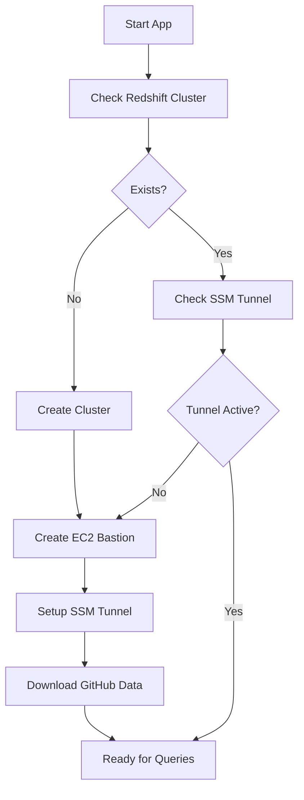
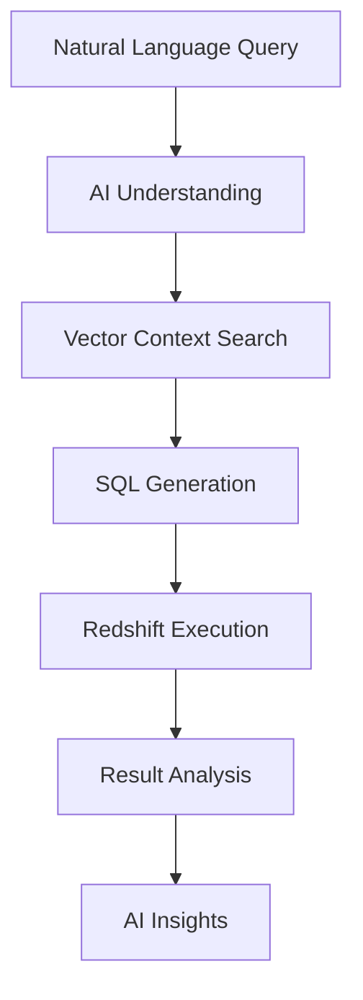

# GenAI Sales Analyst
*(Powered by Amazon Bedrock and Amazon Redshift)*

A fully automated Streamlit application that transforms natural language questions into SQL queries and provides intelligent analysis of sales data using Amazon Bedrock, LangGraph, and FAISS vector search with complete AWS infrastructure automation.


## 🚀 Features

- **Complete AWS Automation**: Automatically creates Redshift cluster, EC2 bastion, and SSM tunnels
- **Natural Language to SQL**: Ask questions in plain English, get SQL queries automatically
- **Intelligent Analysis**: AI-powered insights and explanations of your data
- **Vector Search**: FAISS-powered semantic search for relevant database context
- **LangGraph Workflow**: Structured AI workflow with error handling and recovery
- **GitHub Data Integration**: Automatically downloads complete Northwind dataset from GitHub
- **Zero Configuration**: Just add AWS credentials and run!

## 🏗️ Architecture

```
┌─────────────────┐    ┌──────────────────┐    ┌─────────────────┐
│   Streamlit UI  │───▶│  Amazon Bedrock  │───▶│  Amazon Redshift│
└─────────────────┘    └──────────────────┘    └─────────────────┘
         │                       │                       │
         ▼                       ▼                       ▼
┌─────────────────┐    ┌──────────────────┐    ┌─────────────────┐
│ FAISS Vector   │    │   LangGraph      │    │   EC2 Bastion   │
│ Store           │    │   Workflow       │    │   + SSM Tunnel  │
└─────────────────┘    └──────────────────┘    └─────────────────┘
```

## 📋 Prerequisites

- **AWS Account** with appropriate permissions (Redshift, EC2, IAM, SSM)
- **Python 3.8+** installed
- **AWS CLI** configured (`aws configure`)
- **Git** (optional, for cloning)

## ⚡ Quick Start (5 Minutes!)

### 1. Clone or Download
```bash
git clone https://github.com/AWS-Samples-GenAI-FSI/Sales-Analyst-Bedrock-Redshift-.git
cd Sales-Analyst-Bedrock-Redshift-
```

### 2. Install Dependencies
```bash
pip install -r requirements.txt
```

### 3. Configure AWS Credentials
```bash
cp .env.example .env
# Edit .env with your AWS credentials
```

**Required Environment Variables:**
```bash
# AWS Configuration
AWS_REGION=us-east-1
AWS_ACCESS_KEY_ID=your_access_key_here
AWS_SECRET_ACCESS_KEY=your_secret_key_here

# Redshift Configuration (auto-configured)
REDSHIFT_HOST=localhost  # Auto-configured via SSM tunnel
REDSHIFT_PORT=5439
REDSHIFT_DATABASE=sales_analyst
REDSHIFT_USER=admin
REDSHIFT_PASSWORD=Awsuser123$
```

### 4. Run the Application
```bash
streamlit run app.py
```

### 5. Automatic Setup Process
The app will automatically:
- ✅ **Create Redshift cluster** (ra3.xlplus, single-node)
- ✅ **Launch EC2 bastion host** with latest SSM agent
- ✅ **Establish SSM tunnel** for secure connectivity
- ✅ **Download complete Northwind dataset** from GitHub (91 customers, 830 orders, 2155 order details)
- ✅ **Load data with proper relationships** and foreign keys
- ✅ **Initialize AI components** and vector store
- ✅ **Ready for natural language queries!**

**Total setup time**: ~5-8 minutes

## 💬 Example Questions

### Customer Analytics
- "What are the top 5 customers by order value?"
- "Which customers haven't placed orders recently?"
- "Show me customer distribution by country"

### Sales Analysis
- "What's the average order value by customer?"
- "Which products are most popular?"
- "Show me sales trends by month"
- "What's the total revenue for each category?"

### Product Insights
- "Which products have the highest profit margins?"
- "Show me inventory levels by supplier"
- "What are the best-selling products in each category?"

### Operational Queries
- "Count the number of orders by country"
- "What's the distribution of order priorities?"
- "Show me shipping performance by carrier"

## 📊 Complete Dataset

The application automatically loads the **complete Northwind dataset**:

| Table | Records | Description |
|-------|---------|-------------|
| **customers** | 91 | Customer information and demographics |
| **orders** | 830 | Order headers with dates and shipping |
| **order_details** | 2,155 | Individual line items with quantities and prices |
| **products** | 77 | Product catalog with categories and pricing |
| **categories** | 8 | Product categories and descriptions |
| **suppliers** | 29 | Supplier information and contacts |
| **employees** | 9 | Employee data and territories |
| **shippers** | 3 | Shipping company information |

**Data Source**: Automatically downloaded from multiple GitHub repositories with fallback sources for reliability.

## 🔧 AWS Infrastructure Details

### Automatically Created Resources

#### Amazon Redshift
- **Cluster Type**: Single-node ra3.xlplus
- **Database**: sales_analyst
- **Schema**: northwind
- **Security**: VPC with security group rules
- **Access**: Via SSM tunnel (localhost:5439)

#### EC2 Bastion Host
- **Instance Type**: t3.micro
- **AMI**: Amazon Linux 2 (latest)
- **Role**: EC2-SSM-Role with SSM permissions
- **Purpose**: Secure tunnel to private Redshift cluster

#### IAM Resources
- **Role**: EC2-SSM-Role
- **Policy**: AmazonSSMManagedInstanceCore
- **Instance Profile**: For EC2 SSM access

#### SSM Session Manager
- **Port Forwarding**: Remote host tunneling
- **Local Port**: 5439
- **Target**: Redshift cluster endpoint
- **Security**: No SSH keys required

### Cost Optimization
- **Redshift**: ~$0.25/hour (remember to cleanup!)
- **EC2**: ~$0.01/hour (t3.micro)
- **Total**: ~$0.26/hour during usage

## 🛠️ Development

### Project Structure
```
├── app.py                           # Main Streamlit application
├── cleanup.py                       # AWS resource cleanup script
├── setup_for_distribution.py        # Distribution setup helper
├── requirements.txt                 # Python dependencies
├── .env.example                    # Environment variables template
├── src/
│   ├── bedrock/                    # Amazon Bedrock integration
│   ├── graph/                      # LangGraph workflow components
│   ├── vector_store/               # FAISS vector search
│   ├── monitoring/                 # LangFuse monitoring
│   └── utils/
│       ├── redshift_connector.py   # Redshift database operations
│       ├── redshift_cluster_manager.py  # AWS infrastructure automation
│       ├── github_data_loader.py   # GitHub dataset integration
│       ├── s3_data_manager.py      # S3 data caching
│       └── northwind_bootstrapper.py    # Database setup automation
└── assets/                         # Static assets and images
```

### Key Automation Components

#### 1. Redshift Cluster Manager (`src/utils/redshift_cluster_manager.py`)
- Automatic Redshift cluster creation
- EC2 bastion host provisioning
- SSM tunnel establishment
- Security group configuration

#### 2. GitHub Data Loader (`src/utils/github_data_loader.py`)
- Multi-source data downloading
- Automatic fallback mechanisms
- Data validation and normalization
- Complete dataset assembly

#### 3. Infrastructure Automation
- IAM role and policy creation
- SSH key pair management
- SSM agent installation and configuration
- Network security setup

## 🔍 How It Works

### 1. Infrastructure Setup


### 2. Query Processing


### 3. Data Flow
- **GitHub** → **Local Processing** → **Redshift Tables**
- **User Query** → **Bedrock AI** → **SQL** → **Redshift** → **Results**
- **Metadata** → **FAISS Vector Store** → **Context Retrieval**

## 📈 Performance Optimization

### Database Performance
- **Redshift Optimizations**: Automatic VACUUM and ANALYZE
- **Query Caching**: Session-based result caching
- **Connection Pooling**: Efficient connection management

### AI Performance
- **Model Selection**: Optimized for Redshift SQL syntax
- **Context Caching**: Persistent vector store
- **Prompt Engineering**: Redshift-specific SQL patterns

### Infrastructure Performance
- **SSM Tunnel**: Persistent connection with health checks
- **Data Loading**: Parallel processing and batch operations
- **Metadata Caching**: Reduced database introspection calls

## 🚨 Troubleshooting

### Common Issues

**SSM Agent Version Error**
```bash
# The app automatically installs the latest SSM agent
# If issues persist, check EC2 instance logs
aws logs describe-log-groups --log-group-name-prefix /aws/ec2
```

**Redshift Connection Issues**
```bash
# Check tunnel status
netstat -an | grep 5439

# Verify Redshift cluster
aws redshift describe-clusters --cluster-identifier sales-analyst-cluster
```

**Data Loading Failures**
```bash
# Check GitHub connectivity
curl -I https://raw.githubusercontent.com/jpwhite3/northwind-SQLite3/master/csv/customers.csv

# Verify S3 fallback
aws s3 ls s3://sales-analyst-northwind-data/
```

### Debug Mode
Enable detailed logging:
```python
import logging
logging.basicConfig(level=logging.DEBUG)
```

### Manual Cleanup
If automatic cleanup fails:
```bash
python cleanup.py
```

Or manually:
```bash
# Delete Redshift cluster
aws redshift delete-cluster --cluster-identifier sales-analyst-cluster --skip-final-snapshot

# Terminate EC2 instances
aws ec2 describe-instances --filters "Name=tag:Name,Values=sales-analyst-bastion"
aws ec2 terminate-instances --instance-ids i-xxxxxxxxx
```

## 💰 Cost Management

### Automatic Cost Controls
- **Single-node Redshift**: Minimal compute costs
- **t3.micro EC2**: Free tier eligible
- **Auto-cleanup script**: Easy resource removal

### Cost Monitoring
```bash
# Check current costs
aws ce get-cost-and-usage --time-period Start=2024-01-01,End=2024-01-31 --granularity MONTHLY --metrics BlendedCost

# Set up billing alerts
aws budgets create-budget --account-id YOUR_ACCOUNT_ID --budget file://budget.json
```

### Estimated Costs
- **Development/Testing**: $2-5/day
- **Production Usage**: $10-20/day
- **Remember**: Always run `python cleanup.py` when done!

## 🔒 Security Features

### Network Security
- **Private Redshift**: No public internet access
- **SSM Tunneling**: Encrypted connections
- **Security Groups**: Minimal required ports

### Access Control
- **IAM Roles**: Least privilege principles
- **Session Manager**: No SSH keys required
- **Temporary Credentials**: Automatic rotation

### Data Protection
- **Encryption**: At rest and in transit
- **VPC Isolation**: Network segmentation
- **Audit Logging**: CloudTrail integration

## 🤝 Contributing

We welcome contributions! Please see our [Contributing Guidelines](CONTRIBUTING.md) for details.

### Development Setup
```bash
# Clone the repository
git clone https://github.com/AWS-Samples-GenAI-FSI/Sales-Analyst-Bedrock-Redshift-.git

# Create virtual environment
python -m venv venv
source venv/bin/activate  # On Windows: venv\Scripts\activate

# Install development dependencies
pip install -r requirements.txt

# Run tests
pytest tests/
```

### Testing Infrastructure
```bash
# Test Redshift connection
python -c "from src.utils.redshift_connector import get_redshift_connection; print('✅ Connected')"

# Test data loading
python -c "from src.utils.github_data_loader import download_northwind_from_github; print('✅ Data loaded')"

# Test cleanup
python cleanup.py --dry-run
```

## 📄 License

This project is licensed under the MIT License - see the [LICENSE](LICENSE) file for details.

## 🆘 Support

- **Issues**: [GitHub Issues](https://github.com/AWS-Samples-GenAI-FSI/Sales-Analyst-Bedrock-Redshift-/issues)
- **Discussions**: [GitHub Discussions](https://github.com/AWS-Samples-GenAI-FSI/Sales-Analyst-Bedrock-Redshift-/discussions)
- **AWS Support**: [AWS Support Center](https://console.aws.amazon.com/support/)

## 🏷️ Tags

`aws` `redshift` `bedrock` `streamlit` `ai` `sql` `natural-language` `langraph` `faiss` `sales-analytics` `business-intelligence` `genai` `llm` `automation` `infrastructure-as-code`

---

**Built with ❤️ by the AWS GenAI FSI Team**

*Experience the future of data analysis with complete AWS automation!*
